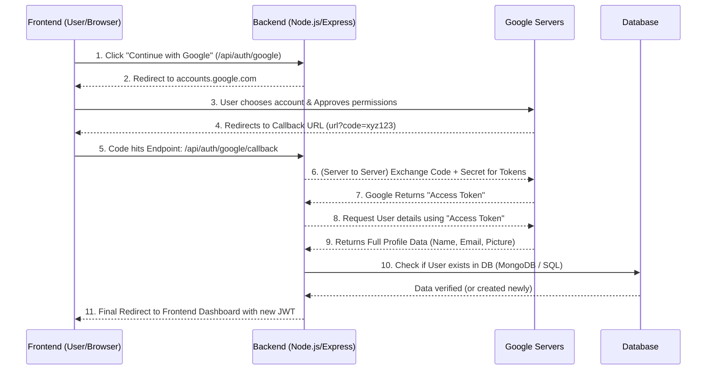

# Google OAuth 2.0 In-Depth Guide (English)

> [!NOTE]  
> In this guide, we will understand in detail how Google OAuth (e.g., "Continue with Google") works on both the backend and frontend, what role the packages play, and what happens behind the scenes.

## 1. Use of Packages (Which packages & Why?)

In a Node.js and Express environment, we mostly use these packages:

- **`passport`**: This is the most famous authentication middleware for Node.js. Its advantage is that it provides a standard design and framework for authentication (whether you use Google, Facebook, or local email/password).
- **`passport-google-oauth20`**: This is a "Strategy" for passport. OAuth itself is a very complex process involved in sending requests and exchanging tokens. This package automatically handles this entire complex flow so that we don't have to hit Google's APIs manually.
- **`jsonwebtoken` (JWT)**: After verifying the user from Google, we need to maintain the user's identity in our app (so the user doesn't have to log in repeatedly). For this, we create our own JWT token and send it to the frontend.

## 2. What are Client ID, Client Secret, and Callback URL?

When creating a project on the Google Cloud Console, you get these 3 things:

- **Client ID**: This is your application's **Public Username** (or ID card). When your app sends a request to Google, Google identifies that this request is from the "Royal Property Finder" app using this ID.
- **Client Secret**: This is your application's **Password**. When the backend requests the user's secret data and data token from Google, it sends this secret key to prove that "This is indeed my app and I am sending this request, it hasn't been bypassed by any hacker." This is always kept in the `.env` file and **is never shown to the frontend or the user**.
- **Callback URL**: When the user allows permission on Google (e.g., clicks continue), Google needs to know which URL/Page to send the user back to after the process is complete. The Callback URL is a specific route/endpoint on our backend because Google sends an important **"authorization code"** in the URL when redirecting to fetch user data.

## 3. Endpoints That Need to Be Created

We generally have to create 2 routes/endpoints on the backend:

1. `GET /api/auth/google` **(The Initiator)**
   - **Why created?**: To redirect the user to Google’s website (accounts.google.com) where they can see and select their Google account details.
   - **How it works**: When a request (via button click) comes here from the frontend, passport is triggered and sends a redirect directly with the options/scopes (e.g., I want your profile and email) that we defined.
2. `GET /api/auth/google/callback` **(The Receiver)**
   - **Why created?**: When Google successfully completes the authentication process, it sends the user back to this route with a 'code'.
   - **How it works**: On this route, Passport again catches that "code," automatically communicates/verifies the code with Google using the client secret, and as a result, user data is received, which we use to complete the login or register process before redirecting/allowing the user on the frontend.

## 4. Behind the Scenes Flow (Step by Step Story)

When a User clicks **"Continue with Google"** on the frontend:

1. **Frontend Request**: Clicking a button on the frontend directly hits that API (`/api/auth/google`) in the browser URL.
2. **Backend to Google Redirect**: The backend immediately redirects the browser to a special Google login URL. This URL includes your Client ID so Google knows which app it is.
3. **User Action**: The official Google.com login page opens in the browser. The user enters their email and password here (if not already logged in to the browser) and clicks "Continue" / "Allow."
4. **The "Code"**: When the user clicks Allow, Google now redirects your user's browser back to your **Callback URL** and appends a long tag at the end of that URL, such as: `?code=4/0AX4X...`. This 'code' is not the actual details, it’s a kind of confirmation ticket!
5. **Code-to-Token Exchange (Backend to Google Servers)**:
   - All of this happens behind the scenes in the backend process (server-to-server connection), which the frontend isn't aware of.
   - Passport sends this particular `code` and our hidden `Client Secret` to Google Servers in a POST request, saying: _"Here is my ID and Password (secret) and Google gave me this ticket (code), please verify it."_
   - Google verifies the Client Secret and confirms the code, and in return, returns an **"Access Token"** to your server.
6. **Fetching Data**: Now using that Access Token, the backend again requests the user's personal details (Name, Email, Profile picture) from the Google user profile API.

## 5. How Does a User Log In / Enter the System?

When the backend receives the full data from Google ('email', 'name', 'picture'), Google's job and the OAuth protocol are basically complete. Now the application and database run their own logic:

- **Check in Database**: The backend checks your DB using `User.findOne({ email })`. Does this email already exist in the database in some form?
- **Register (New User)**: If the id is not found, the backend inserts a new user into your database. In this record, the `password` field is null/empty because the verification has already been handled by Google and is no longer needed. We usually set such accounts to `authProvider = 'google'`.
- **Login (Existing User)**: If that email is already saved in the database, it means the user registered before... so the system retrieves that account info/id from the database.
- **Our Own Token (JWT)**: The purpose of Google's "Access Token" was limited to fetching details, which is now complete (we don't keep that token on the frontend). To keep the user logged in, we generate/sign a NEW token on the backend, **JWT (JSON Web Token)**. Inside this JWT, the user's own Database ID is hidden.
- **Delivery to Frontend**: The final step is for the Callback Endpoint to return an HTTP response that takes the frontend (browser) to its main app page / dashboard route. Along with this, the JWT or session information is usually returned (either in HTTP Only Cookies or a URL Query parameter), which the frontend catches for future API request verification.

### Final Summary

Google OAuth is just a verification or identity validation system where the app doesn't have access to anyone's password; instead, Google verifies and sends you a ticket (code / access token) saying 'yes, the person belongs to this legit human account,' and the rest of the internal account saving and management becomes your responsibility within your own ecosystem.
