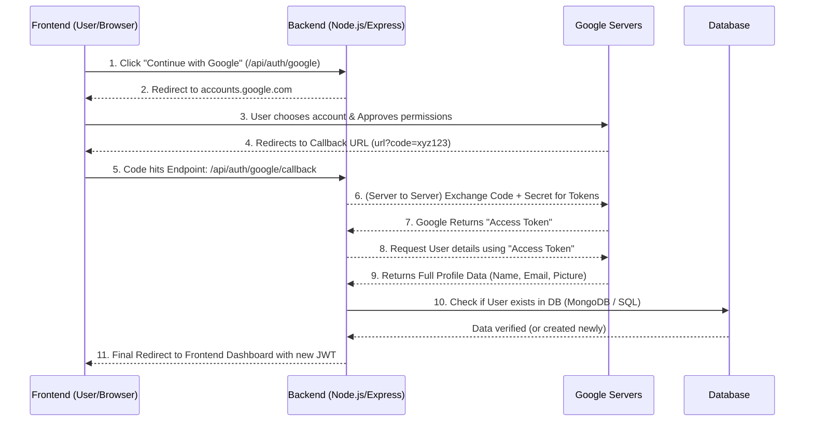

# Google OAuth 2.0 In-Depth Guide (Roman Urdu)

> [!NOTE]  
> Is guide mein hum detail se samjhenge ke Google OAuth (Jaise "Continue with Google") backend aur frontend par kaise kaam karta hai, packages kya role play karte hain, aur parde ke peeche (behind the scenes) kya process hota hai.

## 1. Packages Ka Istemal (Which packages & Why?)

Node.js aur Express environment mein, hum mostly yeh packages use karte hain:

- **`passport`**: Yeh Node.js ka sab se famous authentication middleware hai. Iska faida ye hai ke yeh authentication ka ek standard design aur framework provide karta hai (chahey aap Google use karein, Facebook, ya local email/password).
- **`passport-google-oauth20`**: Yeh passport ki ek "Strategy" hai. OAuth khud ek bohot complex process hai (requests bhejna, token exchange karna). Yeh package is poore complex flow ko automatically handle kar leta hai taake humein directly Google ki apis ko manually handle aur hit na karna parre.
- **`jsonwebtoken` (JWT)**: Google se user ko verify karne ke baad, humein apni app mein us user ki identity banaye rakhni hoti hai (takay user bar bar login na kare). Iske liye hum apna ek JWT token create karte hain aur frontend ko bejh dete hain.

## 2. Client ID, Client Secret, aur Callback URL kya hain?

Google Cloud Console par project banate waqt apko yeh 3 cheezein milti hain:

- **Client ID**: Yeh aapki application ka **Public Username** (ya ID card) hai. Jab aapki app Google ko request bhejti hai, tou Google is ID se pehchanta hai ke yeh request "Royal Property Finder" app ki taraf se ayi hai.
- **Client Secret**: Yeh aapki application ka **Password** hai. Jab backend Google se user ka secret data aur data token request karta hai, tou wo yeh secret key sath bhejta hai saabit karne ke liye ke "Yeh sach mein meri hi app hai aur yeh request main hi bhej raha hu kisi hacker nay bypass nahi kiya". Isko hamesha `.env` file mein rakha jata hai aur **kabhi frontend ko ya user ko nahi dikhaya jata**.
- **Callback URL**: Jab user Google par apni permission allow kar deta hai (Jaise continue dabata hai), tab Google ko pata hona chahiye ke process pura honay k baad user ko wapas kis URL / Page par bhejna hai. Callback URL hamare backend ka ek specific rasta (route/endpoint) hota hai, kyu ke Google wahan redirect karne ke waqt user data lene ke liye ek important **"authorization code"** url mai bhejta hai.

## 3. Endpoints Jo Create Karne Hote Hain

Humein backend par generally 2 routes/endpoints banane hotay hain:

1. `GET /api/auth/google` **(The Initiator)**
   - **Kyun banatay hain?**: User ko Google ki website (accounts.google.com) par redirect karne ke liye jahan wo apne google account details dekh b sakay aur select kar sake.
   - **Kaise kaam karta hai?**: Jab frontend se request (via button click) yahan aati hai, tou passport trigger hota hai aur request ko seedha redirect kar deta hai un options/scopes (jaise mje apka profile or email chahiya) k saat jo hum ny btayi hain.
2. `GET /api/auth/google/callback` **(The Receiver)**
   - **Kyun banatay hain?**: Jab Google authentication process successfully pura karta hy, tou is route par user ko wapas bhejta hai ek 'code' k sath.
   - **Kaise kaam karta hai?**: Is route pe again Passport us "code" ko pakarhta hy, Google se automatically baatchit/verify karta hy code ko client secret ki madad se, aur iske nateejay main user data milti hai jis se hum login ya register process khatam karke frontend pe redirect / allow kardete hain.

## 4. Behind the Scenes Flow (Kahaani Step by Step)

Jab ek User frontend par click karta hai **"Continue with Google"**:

1. **Frontend Request**: Frontend se ek button dabaane pe seedha browser url apke us api (`/api/auth/google`) ko hit karta hai.
2. **Backend to Google Redirect**: Backend turant browser ko ek special Google k login URL par redirect kar deta hai. Is URL main aapki Client ID shamil hoti hai takay Google ko pta chale kon si app hy.
3. **User Action**: Browser pe Google.com ka official login page khulta hai. User yaha email aur password daalta hy (agar woh browser me login na ho) aur "Continue" / "Allow" dabata hai.
4. **The "Code"**: Jab user Allow karta hai, Google ab apke user k browser ko redirect karke dobara aapke **Callback URL** par bhejta hy aur us URL ke aakhir mein ek lamba tag lagata hai jaise k: `?code=4/0AX4X...`. Yeh 'code' asal details data nahi hai, yeh ek qisam ki confirmation ticket hy!
5. **Code-to-Token Exchange (Backend se Google Servers)**:
   - Yeh sab backend process ke anddar parde ke peeche (server-to-server connection) ho raha hota hai jiska frontend ko pata nhi.
   - Passport is particular `code` ko ur hamare chuppay hoye `Client Secret` ko direct Google Servers par POST request me bhejta hai kehty huay: _"Ye rha mera ID aur Password (secret) aur Google ne mjhe ye ticket(code) dia hy verify krdyn"_.
   - Google Client Secret verify karta hai r code confirm karr ke badlay mein aap server ko ek **"Access Token"** return kardeta hai.
6. **Fetching Data**: Ab us Access Token ko istemal karte huay, backend dobara Google user profile API se user ki personal details (Name, Email, Profile picture) receive mangwata hai.

## 5. User System Mein Kaise Login / Enter Hota Hai?

Jab backend ko Google se user ka mukammal data ('email', 'name', 'picture') mil jata hai, yahan Google ka kaam aur OAuth ka protocol basically complete / khatam ho jata hai. Ab application aur database ki apna logic run karta hai:

- **Check in Database**: Backend apke DB main check karta hai `User.findOne({ email })`. Kya database mein ye email pehle se mujood hai kisi form mein?
- **Register (Naya User)**: Agar id nah mili, tou backend ek naya user aap ki database mein insert kardeta hai. Is record main `password` ka scene null / empty hota hy kyu ke pass verification to google p phele e handle kiya ja chuka hota hai or zaroorat nai hoti. Hum aese acc ko usally authProvider = 'google' set kar detey hain.
- **Login (Purana User)**: Agar wo email database mein pehlai se save hy, is k matlab user phele register hwa thaa... tu system us account info/ id ko database sy bahar kheenchna (retreive) hai.
- **Humara Apna Token (JWT)**: Google wale "Access Token" ka maqsad sirf details lane tak mehdood thaa jo purra hogaya (hum us token ko frontend me nhi rakhty). Hum user k login continue rakhne kliye Backend par aik Naya apna Token, **JWT (JSON Web Token)** generate/sign karte hain. Is JWT ke andar user ki apni Database ID chhupi hoti hy.
- **Delivery to Frontend**: Akhiri step mai Callback Endpoint finally HTTP response bhejta hai jo ab frontend (browser) ko us k main app page / dashboard route par le jata hai. Saat hi saath is JWT ya session information ko aam taur par (ya HTTP Only Cookies ya URL Query parameter mein) return kar deta hai jisko frontend catch kar leta hain future request api verification kliye.

### Final Summary

Google OAuth sirf verification or identity validation ka nizam hai jis mein app ke pass kisi k password ki access nai hoti balke google verify karkey ek ticket (code / access token) ap ko bhejtha hai k 'yes the banda belongs to this legit human account', aur baaki internal account save krna ya manage krn ye app ki zimedari bun jati hi apne hi ecosystem k hisabsay.
